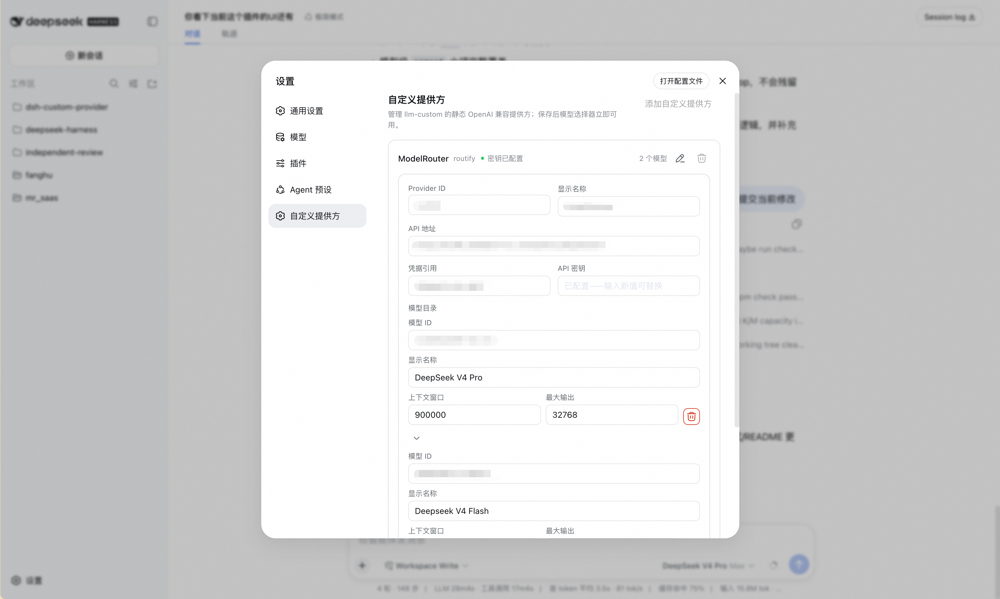
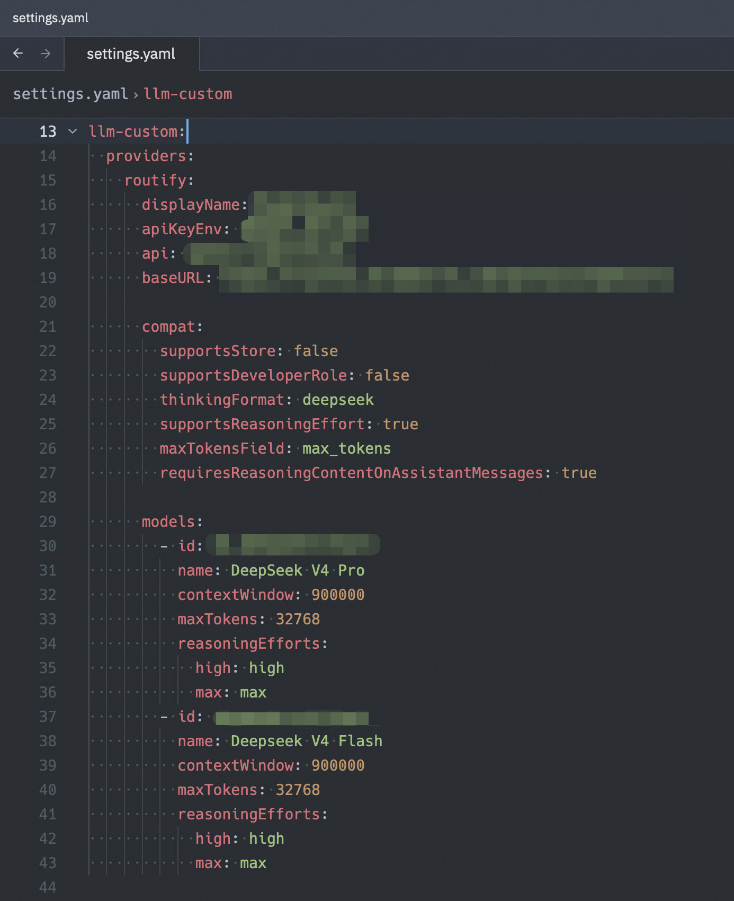

# dsh-custom-provider

[English](README.md) | [简体中文](README.zh.md)

一个用于在 Web 设置页或 `settings.yaml` 中配置静态提供方路由与模型目录的 DSH 插件。每条路由可选择 OpenAI Chat Completions、OpenAI Responses 或 Anthropic Messages。

## 解决的问题

模型接口往往不只需要 API 地址和密钥：还需要选择线协议，模型目录可能需要预先声明，模型容量需要明确配置，推理参数、消息回放等请求字段也可能有不同要求。

`dsh-custom-provider` 将这些信息注册为 DeepSeek Harness（DSH）可直接使用的提供方路由。配置后的模型会出现在 DSH 原生模型选择器中，并继续使用 DSH 标准的流式输出、工具调用、usage、finish reason、取消和推理档位流程。

## 提供的方案

- 中英双语 Web 设置页，可新增、编辑和删除自定义提供方。
- 每条路由可选择 `openai-completions`、`openai-responses` 或 `anthropic-messages`。
- 基于 `settings.yaml` 的声明式 `llm-custom.providers` 配置。
- 静态模型目录，不依赖提供方的 `/models` 接口。
- 每次请求通过 DSH 凭据服务解析密钥，API 密钥不会写入 `settings.yaml`。
- 支持提供方级默认值与模型级覆盖的 OpenAI Chat Completions 兼容字段。
- 复用 DSH 的 pi-ai 流适配器，完成各协议的请求序列化、文本与工具调用流、usage、finish reason、取消和回放。
- 替换路由注册前先校验完整配置，避免无效修改被部分应用。

## 实际截图

### Web 设置页

可在 DSH Web 中管理提供方凭据、接口地址、模型、容量和高级兼容字段。



### YAML 配置

同一份提供方和模型目录也可以直接通过 `settings.yaml` 管理。



## 环境要求

- Node.js `^22.19.0` 或 `>=24.0.0`
- 启用了 Web profile 的 DeepSeek Harness
- 与 DSH `0.1.0-rc.7` 兼容的相关包；完整契约见 [`peerDependencies`](package.json)

## 安装

直接将已发布的包安装到 DSH Web profile：

```sh
npx @deepseek-ai/dsh plugin --profile web add @linziyanleo/dsh-custom-provider
```

检查 DSH 是否成功加载 bundle 及其配置命名空间：

```sh
npx @deepseek-ai/dsh --profile web --dump-config
```

如需可复现安装，请固定包版本，例如 `@linziyanleo/dsh-custom-provider@0.1.1`。

## 配置

### Web 设置页

在 DSH Web 中打开 **设置 → 自定义提供方**，然后：

1. 填写 Provider ID 和显示名称，然后选择接口的线协议。
2. 填写符合该协议要求的 API 地址和凭据引用，详见[协议与 API 地址](#协议与-api-地址)。
3. 输入 API 密钥。该字段只写，通过 DSH 凭据服务保存，不会回显已存储的值。
4. 添加一个或多个模型，填写模型 ID、显示名称、上下文窗口和最大输出。容量字段支持整数以及 `200K`、`1m` 等 `K`/`M` 后缀。
5. 仅在模型需要时展开高级字段，配置自定义推理档位映射；Chat Completions 路由还会显示请求兼容性覆盖。
6. 保存提供方。设置变更应用后，模型会立即出现在模型选择器中。

### `settings.yaml`

```yaml
llm-custom:
  providers:
    example:
      displayName: Example Provider
      apiKeyEnv: EXAMPLE_API_KEY
      api: openai-completions
      baseURL: https://api.example.com/v1
      compat:
        supportsStore: false
        supportsDeveloperRole: false
        thinkingFormat: deepseek
        supportsReasoningEffort: true
        maxTokensField: max_tokens
        requiresReasoningContentOnAssistantMessages: true
      models:
        - id: example-model
          name: Example Model
          contextWindow: 262144
          maxTokens: 32768
          reasoningEfforts:
            off:
            high: high
            max: max
```

`apiKeyEnv` 是凭据引用，不是密钥本身。请通过 DSH 凭据服务或 Web 设置页为该引用配置值。

### 协议与 API 地址

插件会把 `baseURL` 交给选中的协议适配器。地址应配置到该适配器期望的层级：

| `api` | 适配器追加的请求路径 | 常见 `baseURL` |
| --- | --- | --- |
| `openai-completions` | `/chat/completions` | `https://api.example.com/v1` |
| `openai-responses` | `/responses` | `https://api.example.com/v1` |
| `anthropic-messages` | `/v1/messages` | `https://api.example.com` |

对兼容网关，应选择能让最终请求路径正确命中的基础地址。插件会去除末尾斜杠，但不会探测或改写端点。

使用 OpenAI Responses 时，路由协议改为以下值，并保留 OpenAI 风格的 `/v1` 基础地址：

```yaml
api: openai-responses
baseURL: https://api.example.com/v1
```

使用 Anthropic Messages 时，填写 `/v1/messages` 之前的接口根地址：

```yaml
api: anthropic-messages
baseURL: https://api.example.com
```

## 配置字段

以下字段路径均相对于 `llm-custom.providers.<provider-id>`。

在 Web 设置页中，Provider ID 必须以小写字母开头，且只能包含小写字母、数字和连字符。

### 提供方字段

| 字段 | 必填 | 说明 |
| --- | --- | --- |
| `displayName` | 否 | 模型选择器中显示的名称；默认使用 Provider ID。 |
| `apiKeyEnv` | 是 | DSH 凭据引用，每次请求前解析。 |
| `api` | 是 | 线协议：`openai-completions`、`openai-responses` 或 `anthropic-messages`。 |
| `baseURL` | 是 | 所选协议期望层级的绝对 HTTP(S) 地址；末尾斜杠会被规范化。 |
| `compat` | 否 | 该路由下所有模型继承的 Chat Completions 兼容性默认值；其他协议会拒绝该字段。 |
| `models` | 是 | 至少包含一个模型的静态目录；同一提供方内的模型 ID 不可重复。 |

### 模型字段

| 字段 | 必填 | 说明 |
| --- | --- | --- |
| `id` | 是 | 发送给提供方的模型 ID。 |
| `name` | 否 | 模型选择器中显示的名称；默认使用 `id`。 |
| `contextWindow` | 是 | 上下文窗口 token 数，必须为正整数。 |
| `maxTokens` | 是 | 单次响应最大输出 token 数，必须为正整数。 |
| `reasoningEfforts` | 否 | DSH 推理档位到提供方线值的映射；设为 `false` 可禁用推理控件。 |
| `compat` | 否 | 模型级 Chat Completions 兼容字段；其他协议会拒绝该字段；声明值逐项覆盖提供方级值。 |

### 兼容字段

`openai-completions` 的提供方级与模型级 `compat` 支持相同字段。OpenAI Responses 与 Anthropic Messages 路由不使用这些字段；从 Chat Completions 切换协议时，Web UI 会清除它们。

| 字段 | 可选值 | 作用 |
| --- | --- | --- |
| `supportsStore` | `true` / `false` | 请求是否可以发送 OpenAI `store` 参数。 |
| `supportsDeveloperRole` | `true` / `false` | 系统提示是否可以使用 `developer` 角色。 |
| `thinkingFormat` | `openai`、`deepseek`、`openrouter`、`together`、`zai`、`qwen`、`string-thinking`、`ant-ling` | 接口能够识别的推理内容格式。 |
| `supportsReasoningEffort` | `true` / `false` | 请求是否可以发送推理档位参数。 |
| `maxTokensField` | `max_completion_tokens` / `max_tokens` | 请求中承载最大输出上限的字段。 |
| `requiresReasoningContentOnAssistantMessages` | `true` / `false` | 回放助手消息时是否保留 `reasoning_content`。 |

只需声明接口实际需要的兼容字段；模型级未声明字段会继承提供方级值。

### 推理档位映射

DSH 支持的档位为 `off`、`minimal`、`low`、`medium`、`high`、`xhigh` 和 `max`。映射值是提供方接口实际接收的字符串。只有 `off` 可以为空（在 YAML 中为 `null`），且映射中至少需要一个非 `off` 档位。未声明的档位不会出现在选择器中。

```yaml
reasoningEfforts:
  off:
  medium: medium
  high: high
```

模型不提供推理控件时，可设置 `reasoningEfforts: false`。

## 安全与生命周期

- API 密钥在每次请求时解析，不会写入 `llm-custom` 设置。
- 在 Web 设置页替换密钥只会更新对应凭据，不会显示已存储的值。
- 删除提供方或卸载插件不会删除对应凭据，也不会自动删除 `llm-custom` 配置；不再使用时需要分别清理。

## 当前支持范围

- 支持 OpenAI Chat Completions、OpenAI Responses 和 Anthropic Messages 接口
- 仅支持静态、文本输入模型目录
- 不自动发现远端模型
- 不自动注入特定提供方默认值；Chat Completions 兼容字段均为显式配置

## 卸载

```sh
npx @deepseek-ai/dsh plugin --profile web remove @linziyanleo/dsh-custom-provider
```

该命令只会移除插件 bundle；设置与凭据的清理方式见上方“安全与生命周期”。

## 开发与验证

```sh
pnpm install --frozen-lockfile
pnpm check
```

`pnpm check` 会执行离线测试、服务端与客户端类型检查、生产构建和客户端 bundle 断言。真实提供方验收为显式 opt-in，不属于默认检查。

推送到 `main` 后，只有对应 CI 成功才会进入 npm 发布。发布流水线把 `package.json` 中的版本作为最低版本：当它高于 npm 已发布版本时直接使用，否则自动递增 npm 最新版本的 patch 位。`prepublishOnly` 会在 npm 接收发布前再次执行完整检查并校验包内容。

## 许可证

[MIT](LICENSE)
